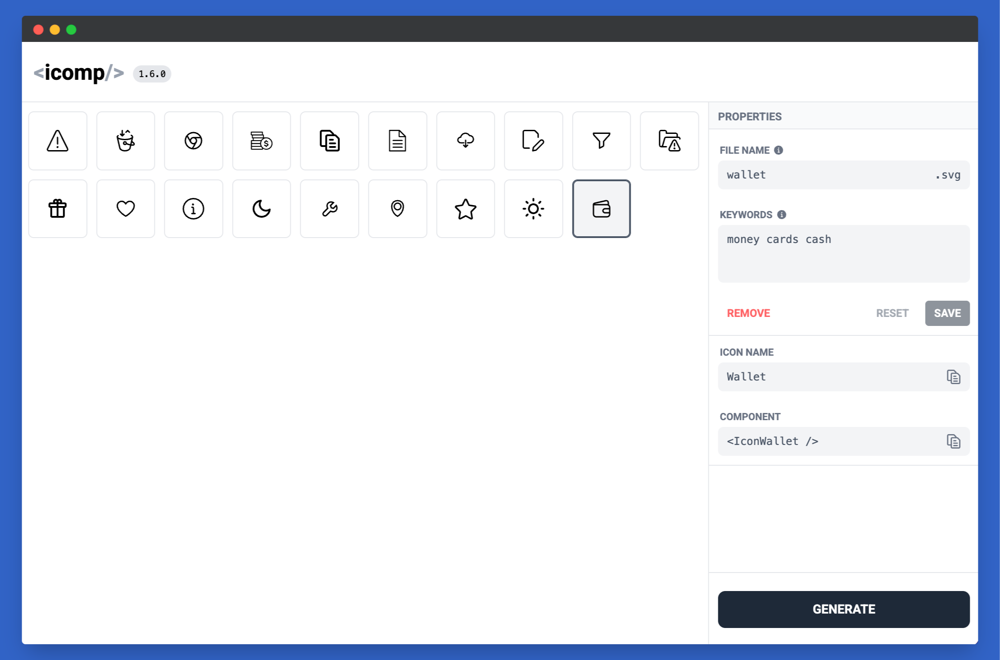

# icomp

A CLI and UI tool for developers to generate React functional Icon components from SVG files.

---
[](https://www.npmjs.org/package/icomp)
[](https://www.npmjs.org/package/icomp)
[](https://www.npmjs.org/package/icomp)
[](https://www.npmjs.org/package/icomp)
---

## ✨ Features

- Convert SVG files to React functional components
- Auto-generate index files
- CLI tool with watch mode for auto-updating components
- Supports SVG attributes and props
- UI tool for easy SVG management
- Simple and intuitive interface
- Customizable component names
- Drag and drop support in UI mode
- Paste SVG code or file directly into the UI
- Paste icon directly from Figma
- Option to generate single or multiple (selected) components
- Lightweight and developer-friendly

---

## 📦 Installation

Install globally:

```bash
npm install -g icomp
```

Or use via npx:

```bash
npx icomp [command]
```

Or as a dev dependency:

```bash
npm install --save-dev icomp
```

---

## 🚀 Usage CLI mode

### Generate React Components from SVGs

```bash
icomp generate --input ./path/to/svg/folder --output ./path/to/output/folder
```

### Example

```bash
icomp generate --input ./icons --output ./src/components/icons
```

### Watch mode (listen for changes)

```bash
icomp generate --input ./icons --output ./src/components/icons --watch
```

---

### Options for `generate` command

| Option          | Description                                                      |
| --------------- | ---------------------------------------------------------------- |
| `-i` `--input`  | Path to the folder containing SVG files.                         |
| `-o` `--output` | Path to the folder where the React components will be generated. |
| `-w` `--watch`  | Watch input dir for changes and auto-generate components.        |

---

### Add script to package.json

```json
{
  "scripts": {
    "gen:icons": "icomp generate -i ./icons -o ./src/components/icons -w"
  }
}
```


---

## 🚀 UI mode



### Start the UI

```bash
icomp ui --input ./path/to/svg/folder --output ./path/to/output/folder
```

### Example

```bash
icomp ui --input ./icons --output ./src/components/icons
```

### Start ui with specific port

```bash
icomp ui --input ./icons --output ./src/components/icons --port 5001
```

---

### Options for `generate` command

| Option          | Description                                                      |
|-----------------|------------------------------------------------------------------|
| `-i` `--input`  | Path to the folder containing SVG files.                         |
| `-o` `--output` | Path to the folder where the React components will be generated. |
| `-p` `--port`   | Start ui with specific port. Default is 5001 or next free port.  |

---

### Add script to package.json

```json
{
  "scripts": {
    "icomp:ui": "icomp ui -i ./icons -o ./src/components/icons -p 5001"
  }
}
```

Then open your browser and go to `http://localhost:5001` to access the UI.

---

## ℹ️ Tips
- You can drag&drop SVG files into the UI.
- You can paste SVG code directly into the UI.
- You can paste icon directly from Figma.
- You can rename, generate, and delete icons in the UI.
- Index is regenerated automatically.

